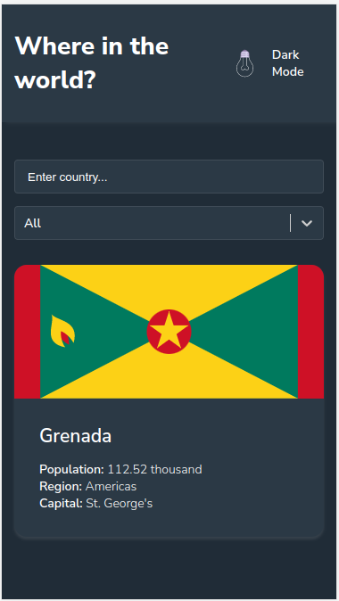
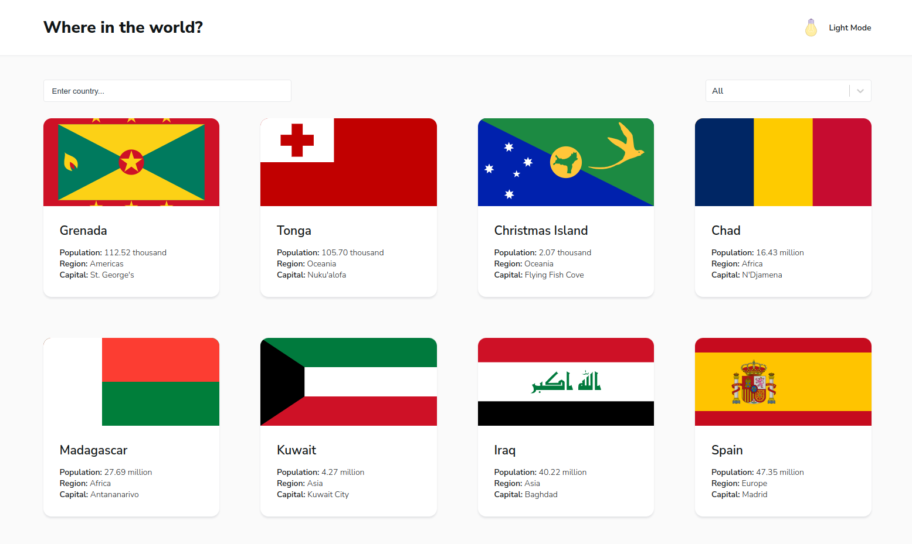
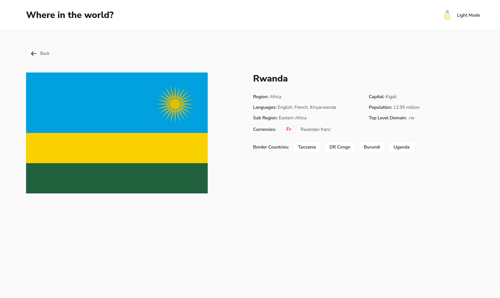

# Frontend Mentor - REST Countries API with color theme switcher solution

This is a solution to the [REST Countries API with color theme switcher challenge on Frontend Mentor](https://www.frontendmentor.io/challenges/rest-countries-api-with-color-theme-switcher-5cacc469fec04111f7b848ca). Frontend Mentor challenges help you improve your coding skills by building realistic projects.

## Table of contents

- [Overview](#overview)
  - [The challenge](#the-challenge)
  - [Screenshot](#screenshot)
  - [Links](#links)
- [My process](#my-process)
  - [Built with](#built-with)

## Overview

### The challenge

Users should be able to:

- See all countries from the API on the homepage
- Search for a country using an `input` field
- Filter countries by region
- Click on a country to see more detailed information on a separate page
- Click through to the border countries on the detail page
- Toggle the color scheme between light and dark mode _(optional)_

### Screenshot

| Mobile layout                                                                                           | Desktop layout                                                                                            |
| ------------------------------------------------------------------------------------------------------- | --------------------------------------------------------------------------------------------------------- |
|        |        |
|  |  |

### Links

- Deploy [Rest countries](https://aleksandr-onopriyenko.github.io/rest-countries/)

## My process

### Built with

- SCSS
- Flexbox
- Grid
- Mobile-first workflow
- [React](https://reactjs.org/) - JS library
- [ReactRouterDom](https://reactrouter.com/) - React Router Dom
- [RtkQuery](https://redux-toolkit.js.org/) - RTK Query from redux/toolkit
